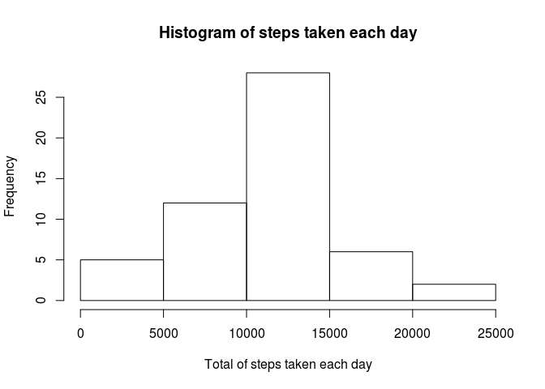
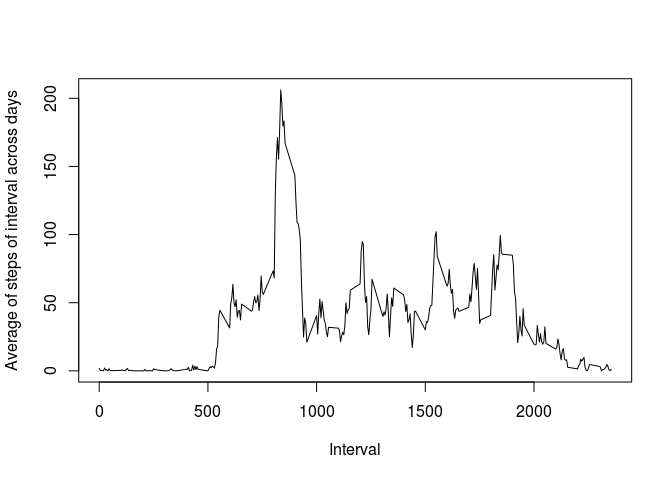
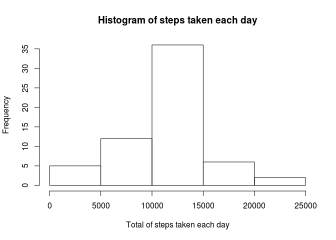
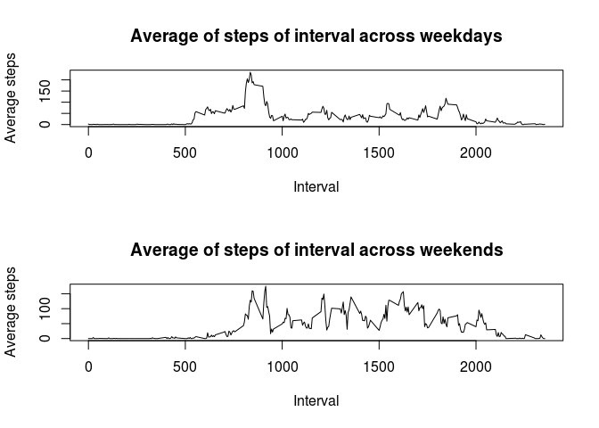

# Reproducible Research: Peer Assessment 1


## Loading and preprocessing the data


```r
unzip("./activity.zip")  
data <- read.csv("activity.csv")
file.remove("activity.csv")
```

```
## [1] TRUE
```

## What is mean total number of steps taken per day?


```r
library(dplyr)
```

```
## 
## Attaching package: 'dplyr'
## 
## The following object is masked from 'package:stats':
## 
##     filter
## 
## The following objects are masked from 'package:base':
## 
##     intersect, setdiff, setequal, union
```

```r
data_processed <- na.omit(data)
steps_by_day <- group_by(data_processed,date)
steps_by_day <- summarise(steps_by_day, sum(steps))
names(steps_by_day)[2] <- "sum_steps"
hist(steps_by_day$sum_steps, xlab="Total of steps taken each day", main="Histogram of steps taken each day")
```

 

```r
mean_steps <- summarise(steps_by_day, mean(sum_steps))
median_steps <- summarise(steps_by_day, median(sum_steps))
print(mean_steps)
```

```
## Source: local data frame [1 x 1]
## 
##   mean(sum_steps)
## 1        10766.19
```

```r
print(median_steps)
```

```
## Source: local data frame [1 x 1]
## 
##   median(sum_steps)
## 1             10765
```


## What is the average daily activity pattern?


```r
average_steps <- select(data_processed, interval, steps)
average_steps <- aggregate(.~interval, data=average_steps, mean)
plot(average_steps$interval,average_steps$steps, type="l", xlab="Interval", ylab="Average of steps of interval across days")
```

 

```r
print(head(average_steps))
```

```
##   interval     steps
## 1        0 1.7169811
## 2        5 0.3396226
## 3       10 0.1320755
## 4       15 0.1509434
## 5       20 0.0754717
## 6       25 2.0943396
```

```r
print(average_steps[which.max(average_steps$average),])
```

```
## [1] interval steps   
## <0 rows> (or 0-length row.names)
```

## Imputing missing values


```r
print(sum(is.na(data)))
```

```
## [1] 2304
```

```r
mean_for_interval <- na.omit(data)
mean_for_interval <- group_by(mean_for_interval, interval)
mean_for_interval <- summarise(mean_for_interval, mean=mean(steps))
proper_data <- data
for(i in 1:nrow(proper_data)){
    if(is.na(proper_data[i,1])){
        interval <- proper_data[i,3]
        tmp <- mean_for_interval[mean_for_interval$interval == interval,]
        proper_data[i,1] <- tmp$mean
    }
}
print(head(proper_data))
```

```
##       steps       date interval
## 1 1.7169811 2012-10-01        0
## 2 0.3396226 2012-10-01        5
## 3 0.1320755 2012-10-01       10
## 4 0.1509434 2012-10-01       15
## 5 0.0754717 2012-10-01       20
## 6 2.0943396 2012-10-01       25
```

```r
proper_data <- group_by(proper_data, date)
proper_data <- summarise(proper_data, sum=sum(steps))
print(proper_data)
```

```
## Source: local data frame [61 x 2]
## 
##          date      sum
## 1  2012-10-01 10766.19
## 2  2012-10-02   126.00
## 3  2012-10-03 11352.00
## 4  2012-10-04 12116.00
## 5  2012-10-05 13294.00
## 6  2012-10-06 15420.00
## 7  2012-10-07 11015.00
## 8  2012-10-08 10766.19
## 9  2012-10-09 12811.00
## 10 2012-10-10  9900.00
## ..        ...      ...
```

```r
hist(proper_data$sum, xlab="Total of steps taken each day", main="Histogram of steps taken each day")
```

 

```r
print(mean(proper_data$sum))
```

```
## [1] 10766.19
```

```r
print(median(proper_data$sum))
```

```
## [1] 10766.19
```

## Are there differences in activity patterns between weekdays and weekends?

```r
Sys.setlocale("LC_TIME", "C")
```

```
## [1] "C"
```

```r
week <- mutate(data_processed, weekday=weekdays(as.Date(date)))
for(i in 1:nrow(week)){
    if(week[i,4] == "Saturday" | week[i,4] == "Sunday"){
        week[i,4] <- "Weekend"
    }else{
        week[i,4] <- "Weekday"
    }
}
week <- group_by(week, date)
average_steps <- mutate(week, average=steps/n())
weekday <- subset(week, weekday=="Weekday")
weekend <- subset(week, weekday=="Weekend")

weekday <- select(weekday, interval, steps)
weekday <- aggregate(.~interval, data=weekday, mean)
weekend <- select(weekend, interval, steps)
weekend <- aggregate(.~interval, data=weekend, mean)

par(mfrow=c(2,1))
plot(weekday$interval,weekday$steps, type="l", xlab="Interval", ylab="Average steps", main="Average of steps of interval across weekdays")
plot(weekend$interval,weekend$steps, type="l", xlab="Interval", ylab="Average steps", main="Average of steps of interval across weekends")
```

 
